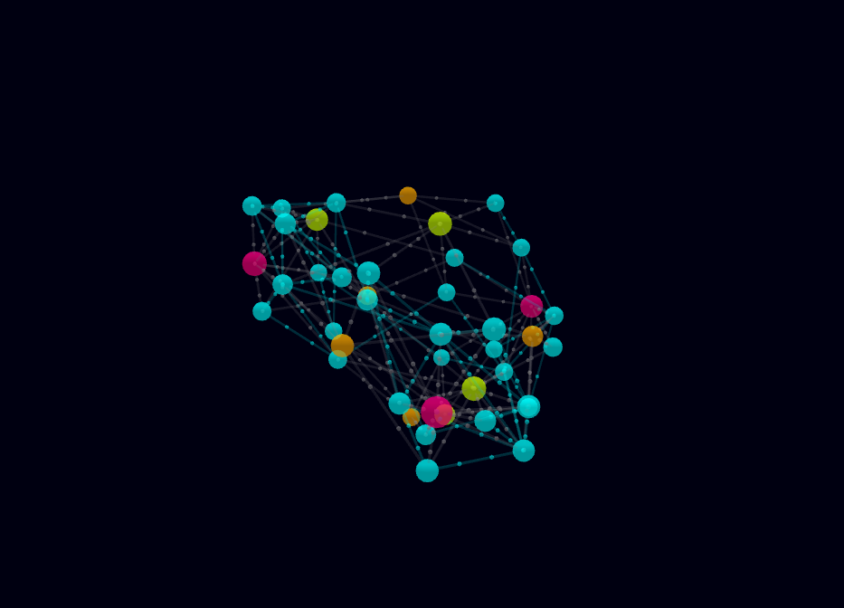

# 3D Academic Literature Semantic Network 🌐✨

An interactive 3D web platform that maps complex relationships among academic fields, research methodologies, prominent scientists, and publications. By combining Natural Language Processing (NLP) with dynamic 3D force-directed graphing, this project converts unstructured data into an immersive knowledge discovery environment. This system is specifically tailored to assist researchers, students, and academics in rapidly identifying cross-disciplinary trends and uncovering hidden patterns in vast repositories of scholarly articles. Traditional literature reviews often suffer from information overload, making it difficult to spot how different authors or methodologies intersect. By moving beyond flat, two-dimensional lists and embracing a spatial representation, users can intuitively grasp complex academic topologies, ultimately accelerating the pace of scientific discovery and fostering innovative collaborations across various domains.



---

## 🛠️ Key Features

* **Interactive 3D Universe:** Spin, pan, and zoom through a live data web using your mouse.
* **Neighborhood Highlighting:** Hover over any node to highlight its direct connections and automatically fade everything else out.
* **Heads-Up Display (HUD):** Click any node to instantly slide open a detailed profile card featuring automated research recommendations.
* **Data-Driven Colors:** Nodes are smartly color-coded into distinct categories (Domains, Methods, Researchers, and Publications).

Additionally, the platform includes real-time physics simulations that organically cluster related nodes, providing immediate visual cues about dense research areas. The layout engine ensures that highly connected entities, such as prolific authors or foundational methodologies, gravitate toward the center of the visual space. Furthermore, the responsive design adapts smoothly to different screen sizes, ensuring that the 3D rendering remains highly performant and visually striking even on less powerful hardware, making advanced literature mapping accessible to a wider audience.

---

## 🏗️ Project Architecture

The system splits the work into two simple layers:

* **The NLP Processing Pipeline (`ACE080BCT035_LAB.ipynb`):** Uses Part-of-Speech (POS) tagging and Named Entity Recognition (NER) to scan text and output clean, structured knowledge pairs (e.g., `[Author] -> AUTHORED -> [Paper]`).
* **The Web Visualization Layer (`index1.html`):** Ingests organized network data and renders it dynamically using WebGL and Three.js libraries via the `3d-force-graph` engine.

This decoupled architecture ensures high maintainability and scalability. The backend NLP pipeline is written in Python, leveraging powerful libraries like spaCy or NLTK to handle complex linguistic parsing, allowing for easy updates to the extraction logic without impacting the frontend. On the client side, the robust WebGL rendering engine efficiently handles thousands of graphical elements simultaneously. This separation of concerns means that researchers can swap out the dataset or tweak the machine learning models while retaining the same high-quality visualization.

---

## 🔬 Methodology

Our methodology centers around a pipeline that transforms raw unstructured academic text into a structured network topology. The process begins with data ingestion, followed by tokenization and entity extraction using advanced NLP techniques. We categorize extracted terms into distinct ontologies: authors, domains, methods, and papers. These entities are then linked based on co-occurrence and semantic similarity scores, producing a weighted graph layout.


This systematic approach guarantees that every node and edge in the visualization represents a verified relationship, enabling accurate tracking of research lineage and methodological evolution across various studies. By iteratively refining the entity recognition models, the methodology minimizes false positives and ensures a clean, reliable dataset for the final visualization engine.

---

## 🌍 Real-World Comparison: Nepal vs. Global Context

To understand the impact of such semantic networks, we can compare its application in Nepal to a global context. In Nepal, universities like Tribhuvan University or Kathmandu University could utilize this tool to map localized research on Himalayan ecology, earthquake engineering, or regional agriculture, identifying isolated research silos and encouraging domestic collaboration where resources might be otherwise constrained. Conversely, outside Nepal, massive global institutions like MIT, Oxford, or international research bodies can deploy this framework on a worldwide scale to track millions of publications. This global application accelerates the development of cutting-edge technologies like quantum computing or global climate modeling by seamlessly linking international scholars, uncovering hidden academic synergies, and managing sprawling, multidisciplinary datasets across borders.

---

## 📊 Data Structure Sample

The application reads structural relationships from the backend pipeline formatted within a JSON dataset using the following node/link layout:

```json
{
  "nodes": [
    {
      "id": "Computer Vision",
      "group": "Domain",
      "category": "Academic Field",
      "rec": "Review literature cross-sections to find multi-disciplinary opportunities."
    }
  ],
  "links": [
    {
      "source": "Dr_G_Hinton",
      "target": "Contrastive Node Clustering via Graph Diffusion Wavelets",
      "label": "AUTHORED"
    }
  ]
}
```

This JSON-based format acts as the universal language bridging our NLP backend and the frontend visualization engine. By adopting such a lightweight and standardized schema, developers can easily integrate data from external APIs, such as Google Scholar, ArXiv, or Semantic Scholar, straight into the 3D graph. The structure is inherently extensible; future iterations can effortlessly incorporate additional metadata fields, such as publication dates, dynamic citation counts, or journal impact factors, without requiring structural overhauls to the core processing engine. This ensures the tool remains future-proof and highly adaptable to growing datasets.
